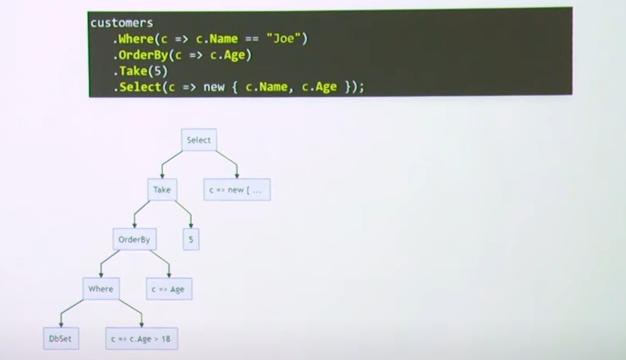
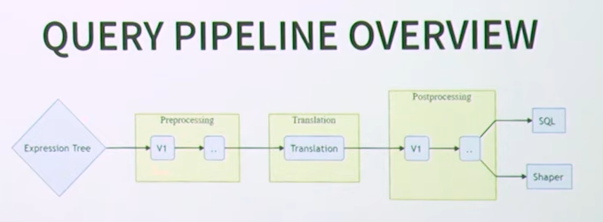
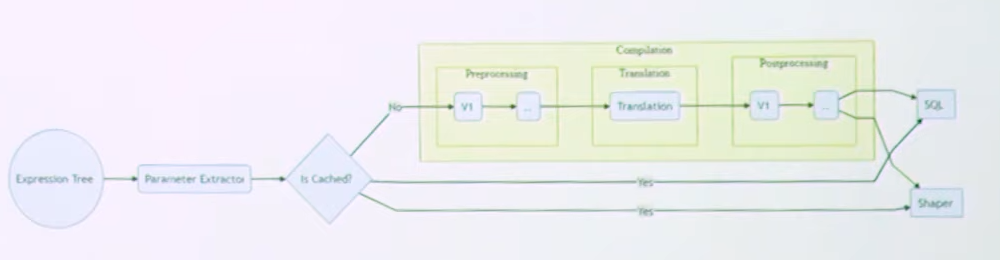

# EF Core - Concepts

Entity Framework (EF) Core serve as an object-relational mapper (O/RM)

- Enables .NET developers to work with a database using .NET objects.
- Eliminates the need for most of the data-access code that typically needs to be written.


## Avantages
- Accélère le développement en éliminant le besoin de code SQL répétitif.
- Peut réduire le temps et les coûts de développement.
  - Écriture des requêtes (et du mapping)
- Compile-time verification
    - IntelliSense
    - Refactoring
    - Debugging


## Désavantages
- Abstraction
  - Les développeurs perdent la compréhension de ce que fait réellement le code
  - Moins le contrôle sur le SQL.
    - Peut être plus lent
    - Peut être plus complexe
    - Peut être plus difficile à déboguer
    - Peut être difficile à utiliser pour des opérations avancées.
    - ORM ne parvient pas à rivaliser avec les requêtes SQL pour les requêtes complexes.


## Considérations
- Garder en tête que EF Core est un ORM.
- Important de bien comprendre les bases de données
  - Architecture, Contraintes, Index, DataType
- EF Core est un outil puissant, mais il ne peut pas tout faire.
- EF Core peut être difficile à maîtriser
  - Beaucoup de concepts à apprendre
  - Beaucoup de façons de faire les choses
  - Beaucoup de choses à configurer
- Suivre les nouveautés
  - EF Core 5 / 3.1 / 3.0 / 2.2 / 2.1 / 2.0 / 1.1 / 1.0
    - Out of support
    - Prior to version 3.0, Entity Framework Core supported client evaluation anywhere in the query
    - Query Pipeline rewritten
  - EF Core 5
    - Many-to-many
    - Split queries
    - Filtered include
    - Table-per-type (TPT) mapping
  - EF Core 6
    - Temporal Tables
    - Scaffolding many-to-many relationships
    - ...
    - Breaking changes
    - ...
  - EF Core 7
    - Delete | Update Bulk
    - Table-per-concrete-type (TPC) inheritance mapping
    - Add/Remove Conventions
    - ...
    - Breaking changes
    - ...
  - EF Core 8
    - Value object
    - Json Column mapping
    - HierarchyId
    - Raw Sql (Unmapped) types
    - ...
    - Breaking changes
    - ...


## ORM

- Many mismatches between C# and SQL
- ORM need to make decisions about how to translate


### How it works

C# (Linq) -> ORM (Expression Tree) -> Sql

``` csharp
// Lambda
Func<int,bool> comparer = num => num < 10;


Expression<Func<int,bool>> comparerExpression = num => num < 10;
comparerExpression.Compile();

// Compiler Services (Not IL)
// Expression Tree for Performance
var numParam Expression.Parameter(typeof (int), "num");
Expression<Func<int, bool>> comparerExpression2 =
  Expression.Lambda<Func<int, bool>>(
    Expression.LessThan( numParam,
    Expression.Constant(10) ),
 numParam);
var compiled2 = comparerExpression2.Compile();

// ORM take the expression tree, convert it to Sql
Select
  ...
from
  ...
Where
  a < 10
```






### Types

| C#       | SqlServer        | Sqlite  | ... |
|----------|------------------|---------|-----|
| string   | nvarchar(max)    | TEXT    | ... |
| bool     | bit              | INTEGER | ... |
| int      | int              | INTEGER | ... |
| Guid     | uniqueidentifier | TEXT    | ... |
| DateTime | nvarchar(max)    | TEXT    | ... |
| DateOnly | not supported    | TEXT    | ... |
| Enum     | int              | TEXT    | ... |


### Provider

Sql Server
- Temporal table
- Hierarchical data
- Spatial data
- ...

Sqlite
- Limitations
  - Schemas
  - Sequences
  - Data Types: DateTimeOffset, Decimal
  - Migrations
    - ...

Most of these limitations are a result of limitations in the underlying SQLite database engine and are not specific to EF.


### Function mappings

| C#                                          | SqlServer                        | Sqlite                         | ... |
|---------------------------------------------|----------------------------------|--------------------------------|-----|
| group.Average(x => x.Property)              | AVG(Property)                    | AVG(Property)                  | ... |
| dateTime.ToString()                         | CONVERT(varchar(100), @dateTime) | CAST(@dateTime AS TEXT)        | ... |
| DateTime.Now                                | GETDATE()                        | datetime('now', 'localtime')   | ... |
| EF.Functions.Like(matchExpression, pattern) | @matchExpression LIKE @pattern   | @matchExpression LIKE @pattern | ... |
| Guid.NewGuid()                              | NEWID()                          | not supported                  | ... |


### Translation

Try the same behavior as the user would expect in C#.

#### Example 1
| C#                                      | Sql                                       | ...                      |
|-----------------------------------------|-------------------------------------------|--------------------------|
| Where( x => x.A == x.B )                | WHERE A = B OR ( A IS NULL AND B IS NULL) | SQL has 3-valued logic   |
| Where( x => x.A == x.B )                | WHERE A = B                               | Exp: A could not be null |
| Not supported                           | lower(A) == lower(B)                      | Costly                   |


#### Example 2
``` csharp
people.Where( x => x.Tasks.Count == 2 )
```
``` sql
select ...
from People
where ( select count(*) from Tasks where Tasks.PersonId = People.Id ) = 2
```

#### Example 3

(Instance equality)
``` csharp
people.Where( x => x == x.Boss )
```

``` sql
Will not map
```


#### Example 4
``` csharp
employees.Include( x => x.Tasks )
```

``` sql
select
from Employees e
left join Tasks t on e.Id = t.EmployeeId
order by e.Id, t.Id
```

Note: Multiple round-trips Vs. Cartesian explosion


#### Example 4
``` csharp
employees.Where( x => SomeFunction(x) )
```

``` sql
-- It depends
-- Substring, Contains, StartsWith, EndsWith, ... equivalent in Sql World

-- No more client evaluation because can brings a lot of data in memory (EF Core 3.0)

-- Client evaluation only for Top-Most Projection
```

## Example 5
``` csharp
customers.Where( x => x.Age > 18 && x.Name != null )
```

Will translate to...
``` csharp
customers.Where( x => x.Age > 18 && true ) // If Name is never null
```

Will translate to...
``` csharp
customers.Where( x => x.Age > 18 ) // If Name is never null
```


### Example 6
``` csharp
customers.Where( x => new[] { 1, 2, 3 }.Contains(x.Id) );
```
``` sql
where c.Id in ( 1, 2, 3 )
```

### Example 7
``` csharp
customers.Where( x => x.Name.Length > 5 );
```
``` sql
where LEN(x.Name) > 5       // SqlServer
where LENGTH(x.Name) > 5    // PostgreSQL
```


## Design
| C#          | Sql           |
|-------------|---------------|
| Inheritance | TPH, TPT, TPC |
| Collection  | Foreign Key   |


### Abstraction

``` csharp
var blogs = context.Blogs
                   .AsEnumerable()    // Retrieve all blogs from the database
                   .Where( blog => StandardizeUrl (blog.Url ).Contains( "..." ) ) // In memory
                   .ToList();

var blogs = context.Blogs
                   .OrderByDescending( blog => blog.Rating )
                   .Select( blog => new
                    {
                        Id = blog.BlogId,
                        Url = StandardizeUrl(blog.Url) // OK
                    } )
                   .ToList();
```


## Resources

EF Core 6.0 (New Features)
- https://learn.microsoft.com/en-us/ef/core/what-is-new/ef-core-6.0/whatsnew

EF Core 7.0 (New Features)
- https://learn.microsoft.com/en-us/ef/core/what-is-new/ef-core-7.0/whatsnew

EF Core 8.0 (New Features)
- https://learn.microsoft.com/en-us/ef/core/what-is-new/ef-core-8.0/whatsnew
