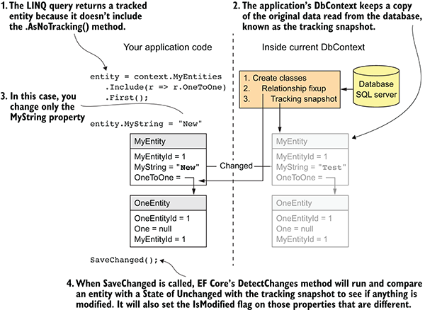
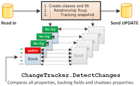
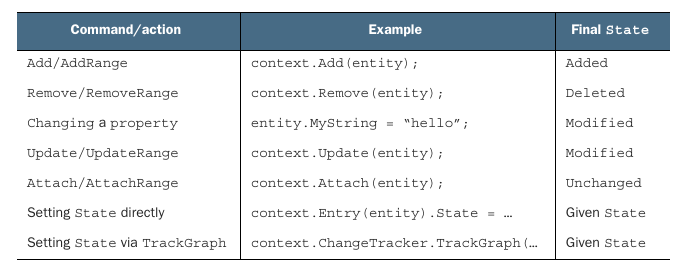
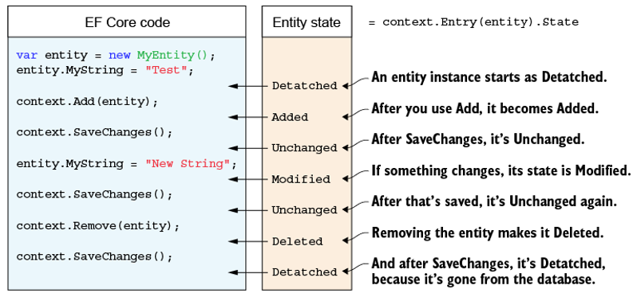

# DbContext - ChangeTracker

DbContext is designed to represent a `short-lived Unit-of-work`

Tracked when
- Returned from a query executed against the database
- Explicitly attached to the DbContext by `Add`, `Attach`, `Update`
- Detected as new entities connected to existing tracked entities

No longer tracked when
- DbContext is disposed
- Explicitly detached from the DbContext by `Remove`, `Detach`, `ChangeTracker.Clear()`
- DbContext is used to query or save other entities











``` csharp

dbContext.Entry(entity).State = EntityState.Modified;

```


Display State

``` csharp
using( var dbContext = new AppDbContext() )
{
    Blog blog = dbContext.Blogs.FirstOrDefault();
    DisplayStates( dbContext.ChangeTracker.Entries() );

    blog.Url = "https://www.google.com";
    DisplayStates( dbContext.ChangeTracker.Entries() );

    context.Blogs.Remove( blog );
    DisplayStates( dbContext.ChangeTracker.Entries() );
}

static void DisplayStates( IEnumerable<EntityEntry> entries )
{
    foreach( var entry in entries )
    {
        Console.WriteLine($"Entity: {entry.Entity.GetType().Name}, State: {entry.State.ToString()} ");
                        // Entity: Blog                          , State: Unchanged
                        // Entity: Blog                          , State: Modified
                        // Entity: Blog                          , State: Deleted
    }
}


```
